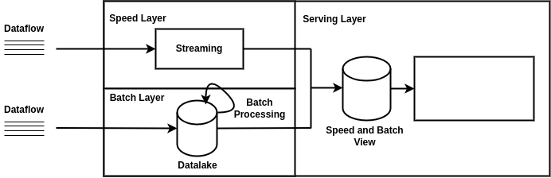
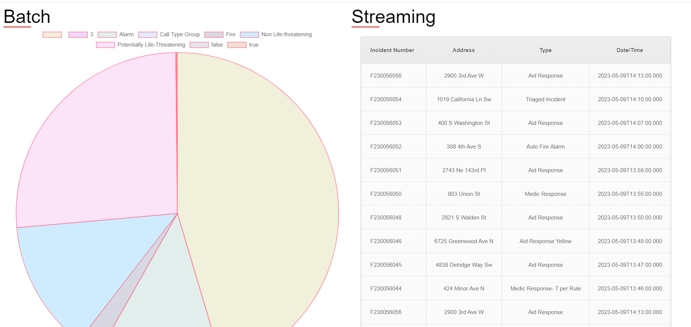

# BigDataVisualisation
This is a part of a big data project which encompasses both batch and data stream processing.
According to the architecture we build for this project , this is **the final part** where we visualize the resulted data from both the [batch](https://github.com/HadilHelali/BigDataBatch) and [data stream processing](https://github.com/HadilHelali/BigDataSpark).

  

* We retreived the data from MongoDB Database using **MongoDB Compass** and developed **this web interface** to visualize the results of the processing 

# Demo 
Here is the demo video where we run the whome project

### Collaborators
This project was developped by :
| Raoua Trimech | Hadil Helali |
| --- | --- |

